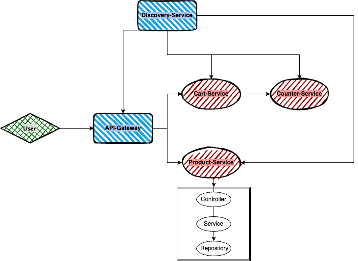

# Micro WebPoS 

请参考spring-petclinic-rest/spring-petclinic-microserivces 将webpos项目改为微服务架构，具体要求包括：
1. 请将系统内的不同微服务实现不同的计算复杂度，通过压力测试实验验证对单个微服务进行水平扩展（而无需整个系统所有服务都进行水平扩展）可以提升系统性能，请给出实验报告；
2. 如有兴趣可在kubernetes或者minikube上进行部署。

1. 架构介绍
   
    该微服务架构的webpos项目由5个微服务组成
   1. api-gateway，网关服务，用于服务的重定向
   2. discovery-service，用于服务的注册，类似与DNS
   3. product-service，商品服务，为webpos提供可扩展的商品管理服务
   4. cart-service，购物车服务，为webpos提供可扩展的购物车管理服务
   5. counter-service，柜台服务，为购物车提供可扩展的复杂的计算服务

2. 技术实现细节
   1. 数据库
      1. cart-service和product-service的数据库管理通过h2实现
      2. product-service的数据来源为JD.com并且缓存通过redis实现
   2. 服务注册
      1. discovery-service通过eureka实现
   3. 负载均衡
      1. cart-service对于counter-service通过restTemplate来实现负载均衡访问
   4. 断路器
      1. TBD
